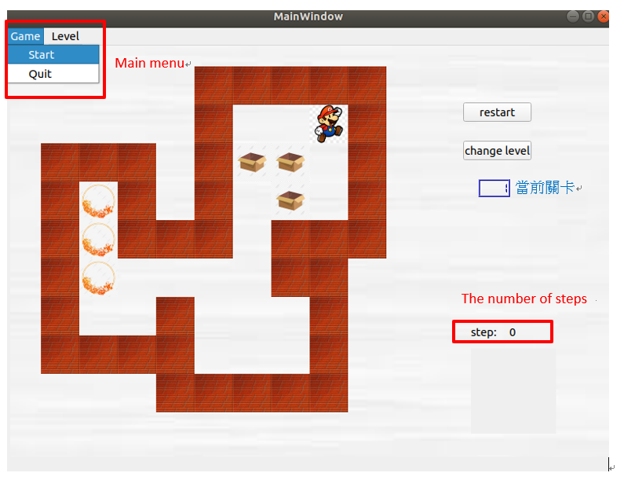

# 2020-pd2-sokoban
https://www.youtube.com/watch?v=M823TdLiVAE  
(沒有聲音  要開字幕)
## Video link
## How to play
用方向鍵控制player將箱子推到圓圈處即可，完成後右下角會顯示通關完成，請自行按  ”change level”button 下一關
## Features
Main menu :分為Game和Level，Game中有Start(從第一關開始)和Quit(關掉視窗)，Level中有3能關卡可以選  
The number of steps:顯示在該關卡走的步數  
Change level button:直接進入下一關並清除右下的資訊(此圖沒顯示)  

## Bonus 
Restart button:回到該關卡的初始狀態且step歸零  

